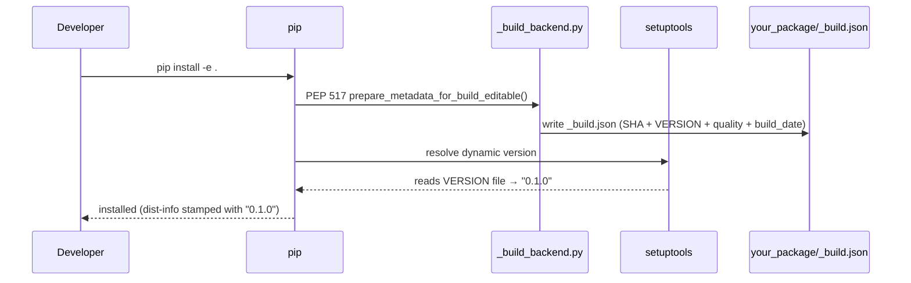
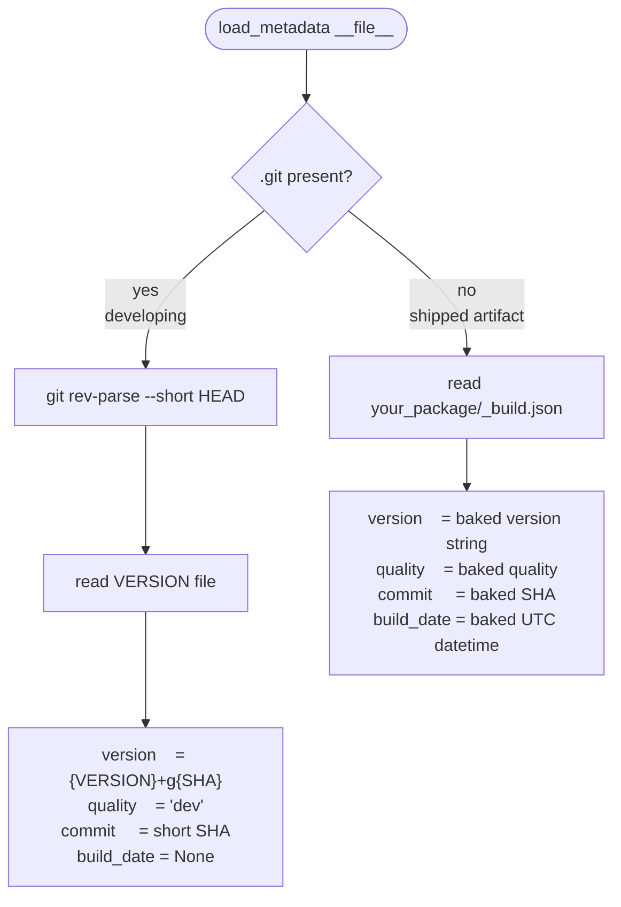
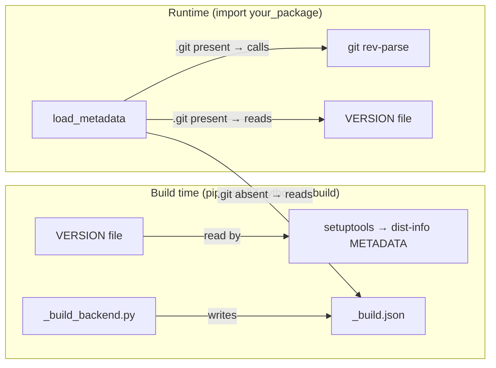

# Versioning

## Motivation

Most Python versioning tools are built around one assumption: **git tags are
the version source of truth**. Tools like `setuptools-scm` derive the version
from `git describe`, which requires a tag to exist before you can produce a
clean version number. This creates ceremony — you need to tag before you can
build, tags need to be pushed before CI works, and the version of your code in
development is always expressed as an awkward distance from the last tag:
`0.1.0.dev3+g701e4ca`.

The deeper issue is that this conflates two separate concerns: **what commit
is this** (a versioning question) and **is this ready to ship** (a releasing
question). Mixing them means every release decision leaks into the commit
history.

### Inspiration: VS Code's `product.json`

VS Code handles this differently. Their build system writes a `product.json`
file into each artifact at build time — not generated from tags, not committed
to the repo. It carries the exact commit, quality level (`stable` / `insider` /
`exploration`), and build date baked in once at the moment the artifact is
assembled. Running from source simply omits it; the application detects the
absence and falls back gracefully.

The key insight is the **separation**:
- The source tree is always clean — no generated files committed
- The artifact carries its own identity — no need to query git at runtime
- Development and production are handled by different code paths with clear intent

### What buildstamp adopts from that model

- A `_build.json` file baked into the wheel at build time (analogous to `product.json`)
- Gitignored — never committed, never stale in the repo
- Runtime branches on a structural fact (`.git` present?) rather than file presence
- Quality level (`dev` / `rc` / `stable`) is a build-time decision, not a
  source-tree decision
- The committed `VERSION` file is the human-controlled anchor — the only file
  you touch when you decide "this body of work deserves a new number"

### What buildstamp does differently from VS Code

VS Code uses `git describe` internally and still relies on tags for stable
releases. buildstamp removes that requirement entirely: the `VERSION` file
replaces the tag. You cut a release by setting `RELEASE_TYPE=stable` and
running the build — no tagging discipline required. This makes it practical
for smaller projects and solo/small-team workflows where tag hygiene is
overhead rather than value.

---

## Vision

The goal is a versioning system that:

- **requires no git tags** — version identity comes from a committed `VERSION`
  file plus a short commit SHA, not from tag annotations
- **never runs git at import time in production** — metadata is baked into the
  built artifact; git is only called in development (`.git` present)
- **puts all build-time logic in one place** — a custom PEP 517 backend
  (`_build_backend.py`) is the single owner of `_build.json`; nothing else
  writes it
- **keeps the runtime simple** — `load_metadata()` makes one decision (`.git`
  present or not) and reads from one source
- **clean separation between versioning and releasing** — the `VERSION` file
  and git SHA are about identity; `RELEASE_TYPE` and `quality` are about
  shipping; they live in different places and never bleed into each other

The design is modelled after VS Code's `product.json`: a plain JSON file
baked into the artifact at build time carrying exact metadata, with a clear
fallback for source checkouts.

---

## Versioning vs releasing

These are two distinct concerns that happen at different times:

**Versioning** — "what commit is this?"

- Always in play, whether developing or shipping
- Driven by the `VERSION` file (base) and git SHA (identity)
- Handled by `load_metadata()` at import time
- Result: `0.1.0+g701e4ca`

**Releasing** — "what quality level was this build intended for?"

- Only relevant at build time, when cutting a wheel to hand to someone
- Driven by the `RELEASE_TYPE` env var (`dev` / `rc` / `stable`)
- Handled by `buildstamp.backend`, baked into `_build.json` once
- Result: `quality = "stable"`, version string `0.1.0`

`quality` is read-only at runtime — a fact baked in at build time. In a
development checkout it is hardcoded to `"dev"` because there is no build.

---

## When to bump VERSION

`VERSION` is bumped manually, by a human, as a deliberate statement of intent.
It is not bumped automatically on every PR or commit.

**PRs do not touch `VERSION`.** Feature branches do their work; `VERSION` is
only changed when someone decides "this body of work is worth a new number."
That is a judgement call, not a mechanical response to a merge.

The bump happens as its own commit, typically right before or at the point of
release. Until then, every commit in development is identified by the current
`VERSION` plus its git SHA — e.g. `0.2.0+g4a1bc3f` — which is already unique
and traceable.

### Does a bump always mean a release?

No. You can bump `VERSION` to `0.2.0` and keep developing on it for weeks or
months before shipping. The bump expresses *intent* ("we are working toward
0.2.0"), not *completion*. The release is a separate act.

```
bump VERSION to 0.2.0
      │
      ├── commit (0.2.0+gabc1234)
      ├── commit (0.2.0+g5def678)
      ├── PR merged (0.2.0+g9abc012)
      ├── PR merged (0.2.0+g3def456)
      │
      └── python scripts/release.py   ← "0.2.0 is now shipped"
```

### Multi-person projects

With multiple contributors, the same rule applies — `VERSION` is not touched
in feature PRs. The person cutting the release bumps it in a release commit.
There are no merge conflicts over `VERSION` because nobody else is touching it.

---

## How `pip install -e .` works in a consumer project

Running `pip install -e .` triggers the PEP 517 backend once. The wheel
version is read directly from the `VERSION` file by setuptools. `_build_backend.py`
(which is a one-liner re-exporting `buildstamp.backend`) writes `_build.json`
with the full runtime metadata before setuptools assembles the package.



After install, `_build.json` exists on disk but is never consulted again
during development — `.git` is present, so `load_metadata()` always uses live git.

---

## How `load_metadata()` works at runtime

`load_metadata()` makes a single decision based on `.git` presence, then reads
from exactly one source. The two paths map cleanly to "developing" vs "shipped".



---

## Two separate concerns



`setuptools` and `load_metadata()` never interact. They both read `VERSION`
and `_build.json` as plain data files at completely different moments.

---

## Design decisions

### Versioning and releasing are separated by design

`load_metadata()` knows nothing about `RELEASE_TYPE`. `quality` is either
read from `_build.json` (artifact) or hardcoded to `"dev"` (checkout).
The decision of what quality level a build is belongs entirely to the backend
at build time. This keeps the runtime free of build-time concerns.

### `.git` presence, not `_build.json` presence, as the branch condition

The original design branched on whether `_build.json` existed. This caused
a staleness problem: `pip install -e .` writes the JSON once, and it then goes
out of date on every subsequent commit. `.git` presence fixes this — any
checkout always computes live metadata.

### `VERSION` file read directly by setuptools — no shim needed

An earlier design used a `_version.py` shim for setuptools' `{attr = ...}`
resolver. Replaced with `version = {file = "VERSION"}` in `pyproject.toml`.
One fewer file, one fewer concept.

### JSON, not Python, for runtime metadata

`_build.json` has no import side-effects, is easy to inspect with any tool,
and cannot accidentally execute code. It is the only artifact the backend
produces.

### No git calls at import time in production

Git is only called by the backend (build time) or by `load_metadata()` when
`.git` is present (development only). A shipped wheel never calls git.

### `VERSION` file as the single version source of truth

The base version (`MAJOR.MINOR.PATCH`, e.g. `0.1.0`) lives in a committed
`VERSION` file. Read by setuptools for wheel metadata and by `load_metadata()`
for the live version string. No version strings duplicated elsewhere.

### No tags required

Versions are not derived from `git describe`. A release can be cut from any
commit without pushing a tag. `RELEASE_TYPE` controls the quality suffix.

### Commit SHA, not commit count

`{VERSION}+g{short SHA}` — e.g. `0.1.0+g701e4ca`. An earlier version
included a commit count (`0.1.0.3+g701e4ca`). Dropped: count implies a linear
history and the SHA alone uniquely identifies the commit.

### No `dirty` flag

Only meaningful at the exact moment of the build, not reproducible, and adds
noise without actionable value.

### No `branch` field

Branch names are mutable. A commit SHA is immutable. The branch can be looked
up from the SHA if needed.

### `build_date` is `None` in development

No meaningful build date exists for a live checkout. `None` is honest.

---

## Version string format

| Scenario | Example | How |
|---|---|---|
| Development (`.git` present) | `0.1.0+g701e4ca` | `VERSION` + git SHA |
| Artifact — `stable` | `0.1.0` | `VERSION` as-is |
| Artifact — `rc` | `0.1.0rc1` | `VERSION` + `rc1` suffix |
| Artifact — `dev` | `0.1.0.dev0` | `VERSION` + `.dev0` suffix |

`RELEASE_TYPE` env var (default: `dev`) controls which artifact format is used.

---

## Files in a consumer project

| File | Purpose |
|---|---|
| `VERSION` | Committed base version (`MAJOR.MINOR.PATCH`) — the only file you edit when bumping |
| `your_package/_build.json` | Generated at build time; gitignored; carries runtime metadata |
| `_build_backend.py` | One-liner: `from buildstamp.backend import *` |
| `scripts/release.py` | Manual release script — sets `RELEASE_TYPE` and triggers the build |
